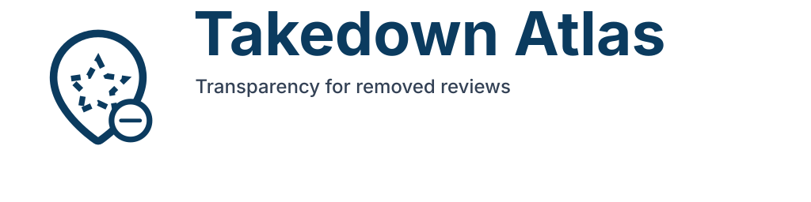

# Takedown Atlas — MVP Stack



> **Transparency for removed reviews.** Neutral, evidence-based, and non-accusatory per the brand voice guide.

This repository implements the MVP described in `prd.md`: a privacy-preserving transparency platform that ingests Google review removal notices, routes them through a verification workflow, and publishes anonymized incidents for public research.

## 🔎 Repository Map

- `backend/` — FastAPI application with Postgres/PostGIS models, moderation/auth endpoints, and Celery tasks.
- `frontend/` — Next.js 14 App Router for landing, submission flow, map, business profiles, and moderation console.
- `workers/` — Celery worker entrypoint (reuses backend code).
- `docs/` — Architectural overview tying implementation back to the PRD.
- `takedown-atlas-brand-starter-kit/` — Logos, color tokens, social banners, and voice guidance.
- `State-Tracker.md` — Emoji snapshot of completed work and upcoming tasks.

## ✨ Brand at a Glance

- **Primary colors:** `#0B3B5F` (primary), `#FFB200` (accent), `#1DA7A1` (teal), `#334155` (slate), `#F6F8FA` (light background), `#0F172A` (dark background).
- **Assets:** `logo/takedown-atlas-logo-primary.svg` for light backgrounds, reversed variant for dark backgrounds, social banner under `social/`.
- **Tokens:** Import `tokens/css-variables.css` or the Tailwind preset (`tokens/tailwind.preset.cjs`) to stay on-brand.
- **Voice:** Neutral, evidence-based, non-accusatory — see `usage/brand-guidelines.md` for copy examples.

## 🛠️ Local Development

### Prerequisites

- Python 3.11+
- Node.js 18+
- Poetry and npm
- Postgres 16 with PostGIS, Redis, and MinIO/S3-compatible storage (Docker compose example pending)

### Backend

```bash
cd backend
poetry install
poetry run alembic upgrade head
poetry run uvicorn backend.app.main:app --reload
```

Environment variables (prefixed with `TAKEDOWN_ATLAS_`) can override defaults. Key settings live in `backend/app/core/config.py`. Copy `backend/.env.example` to `.env` for local overrides (includes SMTP + Mailgun signature keys for local testing). To restrict self-service magic links, populate `TAKEDOWN_ATLAS_MAGIC_LINK_ALLOWED_DOMAINS` and adjust `TAKEDOWN_ATLAS_MAGIC_LINK_DEFAULT_ROLE` (new accounts default to `researcher`).

To start local infrastructure (Postgres + Redis + MinIO + MailHog):

```bash
./scripts/dev.sh
```

The helper script pulls the latest container images and starts: Postgres `localhost:5432` (PostGIS 3.4), Redis `localhost:6379`, MinIO `localhost:9000` (console `9001`), MailHog SMTP `localhost:1025` / UI `localhost:8025`. Create the MinIO buckets once:

```bash
aws --endpoint-url http://localhost:9000 s3 mb s3://takedown-atlas-raw
aws --endpoint-url http://localhost:9000 s3 mb s3://takedown-atlas-public
```

### Worker

```bash
cd backend
poetry run celery -A backend.app.tasks.celery_app.celery_app worker -l info
```

### Frontend

```bash
cd frontend
npm install
npm run dev
```

The frontend imports design tokens from `takedown-atlas-brand-starter-kit/tokens/` and references brand SVGs under `frontend/public/`.

> 💡 Preview new visuals on `#F6F8FA` (light) and `#0F172A` (dark) backgrounds before merging; see the testing guidelines in the brand kit.

## Key Endpoints (FastAPI)

- `POST /v1/submissions`: ingest base64-encoded removal notice payloads.
- `GET /v1/submissions/{token}`: reporter status view.
- `GET /v1/incidents`: filterable public incidents.
- `GET /v1/incidents/leaderboard`: business leaderboard.
- `POST /v1/businesses/{id}/claims`: business representative workflow.
- `GET /v1/moderation/queue`: moderation backlog for verifiers.
- `POST /v1/moderation/submissions/{id}/publish`: publish verified incidents.
- `POST /v1/admin/notices`: log notice-and-action requests against our platform.
- `POST /v1/auth/magic-links`: request a one-time login link for verifier/admin/researcher accounts.
- `POST /v1/auth/magic-links/verify`: exchange a token for a signed API session (used by the frontend).
- `POST /v1/webhooks/mailgun`: accept Mailgun inbound routes for direct email ingestion.

## Implementation Notes

- SQLModel models cover reporters, submissions, verification records, incidents, businesses, claims, moderation actions, and legal notices.
- Celery tasks (`backend/app/tasks/`) stub ingestion, verification, and AI summary generation for future extension with production NLP pipelines.
- Next.js pages follow the MVP user journeys: landing mission, submission form with base64 encoding, MapLibre map for incidents, business profile pages, and moderation console.
- `docs/architecture.md` describes service responsibilities, data model, and workflows aligned with the PRD.

## Next Steps

- Wire real email ingestion (SES/Mailgun) and DKIM/DMARC verification.
- Implement role-based auth, magic links, and session expiry enforcement.
- Expand map clustering, add CSV/JSON exports, and embed transparency reports.
- Finish Docker Compose stack plus automated tests covering ingestion → publication flow.
