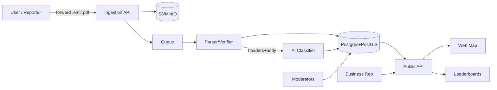

# Project PRD — Open‑source platform to map & analyze Google review removals

> **Mission:** Build a transparent, privacy‑preserving, open‑source platform where people can forward _Google review removal_ emails. We aggregate and verify these incidents, map them globally (initial focus: Germany/EU), rank businesses by frequency and patterns, and use AI to analyze the notices — all to make takedown practices visible and researchable.

---

## 1) Problem & Hypothesis

- **Problem:** Critical but lawful reviews are allegedly removed too easily. Individual users cannot see systemic patterns.
- **Hypothesis:** If we crowd‑source removal notices and analyze them, we can reveal outliers ("black sheep"), support journalists/NGOs, and inform policy debate (e.g., DSA implementation) without defaming anyone.

**Non‑goals (MVP):** We do **not** adjudicate truth of the original review; we visualize and verify the _removal request_ event and its metadata.

---

## 2) Objectives & KPIs

- **O1 Transparency:** Public, filterable map & leaderboard of removal requests.
- **O2 Evidence quality:** ≥75% of published incidents carry cryptographic or header‑level verification of the email source (DKIM/DMARC pass) or signed portal notice.
- **O3 Privacy:** Zero PII leaks in public views; ≤1 substantiated legal complaint per 1,000 published incidents.
- **O4 Adoption:** 1,000 verified submissions in first 6 months in DACH.
- **O5 Research utility:** Quarterly transparency report + open dataset (anonymized) with ≥3 external citations (press/NGO/academia).

---

## 3) User Roles & Personas

- **Reporter (User):** Receives a Google takedown/removal email; forwards/upload it.
- **Verifier/Moderator:** Validates authenticity, redacts PII, resolves duplicates.
- **Business Representative:** Can create a verified business account to respond/contextualize.
- **Researcher/Journalist:** Explores dataset via map/table, downloads anonymized exports.
- **Admin:** Manages policies, abuse workflows, legal requests.

---

## 4) Core User Stories (MVP)

1. As a **Reporter**, I can forward a removal email to a unique address and see a private status page for my submission.
2. As a **Verifier**, I can confirm DKIM/DMARC, auto‑redact PII, and publish an anonymized incident to the map.
3. As a **Researcher**, I can filter incidents by country, platform, reason (e.g., “defamation”), business, date, outcome, and export CSV/JSON.
4. As a **Business Rep**, I can claim a business profile, provide a statement, and see aggregate statistics (rate‑limited, audit‑logged).
5. As an **Admin**, I can action notice‑and‑takedown requests regarding our site, with an appeals trail (DSA‑style).

---

## 5) Scope — MVP vs. Next

**MVP**

- Ingestion: email forwarding, manual upload (.eml/.msg/.pdf/.html), copy‑paste form.
- Parsing: header/body extraction, attachment parsing, URL detection, platform detection (Google Maps), language detection.
- Verification: DKIM/DMARC check, hash of headers, confidence score.
- Redaction: names, emails, phone numbers; optional full text withheld for public view.
- Geo mapping: resolve business via URL/place ID, geocode address; cluster on map.
- Public site: map + leaderboard + business profile pages with timelines.
- AI assist: classify reason/sections, severity, completeness; short neutral summary.
- Governance: moderation queue, audit log, dispute mechanism, transparency page.

**Post‑MVP**

- Browser extension to capture dashboard notices.
- Multi‑platform support (Tripadvisor, Yelp, Trustpilot, Booking, etc.).
- Relationship graph (law firms ↔ businesses ↔ patterns in grounds used).
- Automatic company matching (commercial registry IDs), ownership roll‑ups.
- Public API + BigQuery/Snowflake dataset sync.
- Watchlist & alerts for recurring patterns.

---

## 6) System Architecture (MVP)

- **Frontend:** Next.js (TS), React Server Components, Tailwind + shadcn/ui, MapLibre/Mapbox GL JS for maps, TanStack Table for leaderboards.
- **Backend:** FastAPI (Python) or Node (NestJS). Recommend **FastAPI** for Python‑native NLP.
- **Database:** PostgreSQL 16 + **PostGIS** (geo), **Row Level Security** for per‑reporter access (if using Supabase, RLS built‑in).
- **Search/Analytics:** OpenSearch or PostgreSQL full‑text + trigram; DuckDB for offline exports.
- **Queue/Workers:** Celery/RQ (Python) or BullMQ (Node) for ingestion & AI jobs.
- **Object Storage:** S3‑compatible (MinIO) for raw emails/attachments (private bucket).
- **Email Ingestion:**

  - Option A: **Gmail API** OAuth (user grants read‑only; we fetch specific labels).
  - Option B: **Forwarding alias** via Mailgun/SES/Postmark routes → webhook.
  - Option C: Manual upload of .eml/.pdf.

- **Auth:** Magic link (passwordless), OAuth (Google, GitHub). Reporter can stay pseudonymous.
- **Telemetry:** OpenTelemetry; audit logs stored append‑only.
- **Deployment:** Docker + Fly.io/Render/Supabase + Cloudflare (EU region, e.g., Frankfurt) for GDPR.

---

## 7) Data Model (draft)

**entities**

- `report` (id, submitted_at, reporter_hash, source_method, locale, platform, raw_storage_key, dkim_pass\:boolean, dmarc_pass\:boolean, verification_score:0..1, pii_redacted\:boolean, status:\[draft|needs_review|published|rejected], moderator_id)
- `business` (id, name, google_place_id, address_struct, lat, lon, website, category, country, canonical_slug)
- `incident` (id, business_id, report_id, reason_enum:\[defamation|privacy|ip|other], legal_basis_text, decision:\[removed|restricted|reinstated|pending], action_date, jurisdiction, platform_ref_urls\[])
- `analysis` (incident_id, language, summary_md, classifiers:{reason,policy}, risk_flags\[], confidence, vector)
- `evidence` (incident_id, type:\[email_header|body|screenshot|attachment], storage_key, hash, mime)
- `business_response` (incident_id, text_md, submitted_by, verified\:boolean)
- `moderation` (incident_id, action, actor_id, timestamp, notes)

**privacy**

- No public storage of personal names/emails; `reporter_hash = HMAC(salt, email)`.
- Store raw emails encrypted; public pages show only _extracted fields_ and redacted text.

---

## 8) AI/ML Pipeline

**Goals:** Support moderators, not replace them. Produce explainable labels.

- **Classification** (multi‑label): reason (e.g., defamation), platform, jurisdiction, DSA reference, decision type. Model: _DeBERTa‑v3 base_ / _BERT‑multilingual_ fine‑tuned; or zero‑shot with _Qwen2.5‑7B‑Instruct_ on‑prem.
- **NER & Redaction:** spaCy (de/en) + regex for emails/phones/place IDs; label‑preserving masking.
- **Email authenticity signal:** DKIM/DMARC library + heuristic header scoring.
- **Summarization:** short neutral **markdown** summary (100–160 words) with _hedging language_ (“allegedly”, “according to…”, “we received…”).
- **Embedding & Dedupe:** Sentence‑Transformers `all‑MiniLM‑L6` for near‑duplicate incidents; cosine threshold.
- **Risk/Abuse flags:** detect harassing content, doxxing, PII leaks (openai‑compatible moderation or open‑source `ProtectAI` / `Detoxify`).
- **Scoring:** `incident_score = verify_weight*authenticity + freq_weight*business_frequency + recency_weight*recency + doc_weight*evidence_count` (tunable) for ranking.

**AI Hosting Options:**

- Default **open‑source, self‑hosted** (privacy): vLLM + GGUF models on GPU/CPU; fallback BYO‑key for commercial APIs.

---

## 9) UX — Public Site

- **Landing:** mission, live counters, call‑to‑action to submit.
- **Map:** cluster by density; filters (time window, platform, reason, decision, country, category). Click → incident detail panel.
- **Leaderboards:** businesses by incidents (normalized per month); law firms (if present in headers or submitted by reporter); categories.
- **Business page:** summary stats, trend, map pins, verified responses, moderation history.
- **Transparency:** methods, definitions, data dictionary, quarterly reports, API docs.

**Submission UX**

- Email forwarding guide (Gmail/Outlook) + unique tokenized alias per user (e.g., `report+{token}@domain`).
- Drag‑and‑drop **.eml/.pdf**, instant local redaction preview, consent checkbox.
- Status link (magic URL) delivered to reporter’s inbox.

---

## 10) Governance & Open‑source

- **License (code):** Apache‑2.0.
- **License (datasets):** ODbL 1.0 (or CC‑BY‑4.0 with PII‑free extracts). Raw emails remain private, not redistributed.
- **Stewardship:** lightweight foundation/collective; core maintainers + advisory board (legal/ethics/journalism).
- **Policies:** Code of Conduct, Contribution Guide, Security Policy (responsible disclosure), Data Retention.

---

## 11) Legal & Compliance (non‑exhaustive)

**This is not legal advice.** Key issues & mitigations:

1. **Defamation / Persönlichkeitsrecht**

   - _Risk:_ Publishing claims like “Company X censors criticism”.
   - _Mitigation:_ We publish **incident facts** ("we received a removal notice concerning review URL X on date Y citing reason Z") + **neutral summaries**; no value judgments. Prominent disclaimer: _Data reflects submitted notices; authenticity scored but not guaranteed._ Provide **right of reply** and a **notice‑and‑action** channel.

2. **DSA (EU Digital Services Act)**

   - Not a VLOP; still implement **notice‑and‑action**, reasoned decisions, appeals, transparency reporting.
   - Document our moderation policy; respond timely to legal notices; preserve audit trails.

3. **GDPR**

   - _Data categories:_ email content may contain personal data (names, emails, addresses).
   - _Lawful basis:_ **Consent** of reporter for processing & research publication; **Legitimate Interest** for pseudonymous analytics in public interest.
   - _Minimization:_ Store raw emails encrypted; publish **only redacted excerpts/metadata**. Default retention 24 months (configurable). DSAR/erasure flows.
   - _Cross‑border:_ Host in EU; DPAs with processors; no third‑country transfers unless SCCs.

4. **Copyright/Database rights**

   - Email text may be copyrighted. _Mitigation:_ publish **limited, necessary excerpts** and primarily **metadata** (headers, timestamps, reason labels). Fair‑dealing quotation where needed.

5. **Terms of Service (Google)**

- Avoid automated scraping; rely on user-submitted emails and **publicly shared URLs** only. Cache minimal business metadata (name, address, place_id); prefer official Places API with compliance if required.

---

## 12) Implementation Snapshot (June 2025)

The repository now contains a functional MVP scaffold aligned with this PRD:

- **Backend (FastAPI):** `backend/` exposes ingestion, moderation, business response, and notice-action APIs with SQLModel entities for reporters, submissions, verification records, incidents, businesses, and audit trails. Celery tasks in `backend/app/tasks/` stub ingestion, verification, and AI summarisation pipelines pending production integrations.
- **Worker:** `workers/worker.py` launches Celery workers that share backend services and configuration.
- **Frontend (Next.js):** `frontend/` delivers landing, submission, map, business, and moderation experiences. It consumes the public API, renders MapLibre-based visualisations, and applies shared brand tokens directly from `takedown-atlas-brand-starter-kit/`. The `/magic-login` page handles magic-link authentication and stores JWT sessions client-side.
- **Infrastructure:** `infrastructure/docker-compose.yml` stands up Postgres/PostGIS, Redis, MinIO, and MailHog. Alembic migrations (`backend/alembic/`) manage schema evolution; `scripts/dev.sh` bootstraps containers.
- **Auth & ingestion:** `/v1/auth/magic-links` issues single-use moderator tokens, and `/v1/webhooks/mailgun` verifies Mailgun signatures for inbound email forwarding.
- **Architecture doc:** `docs/architecture.md` maps PRD requirements to service boundaries, data model, and workflows for future contributors.

Remaining gaps before release include production-grade email ingestion, auth, advanced AI classification, full notice handling workflows, transparency report generation, and deployment hardening (Docker Compose, infra as code, CI).
